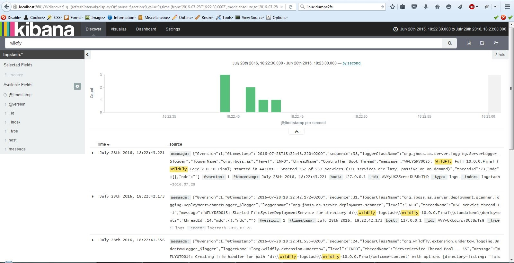

# WildFly Remove Logger with ElasticSearch+Kibana+Logstash

You want to watch console logs from WildFly in a browser?   
All you need is Kibana, Elasticsearch and logstash. 
You can log more than normal server.log files.  
We can, for instance, log JMX like CPU and memory footprint in whatever fancy diagrams. 
In this example I typed "WildFly" to find all occurrences of such word in elastic-search database
which was mirror of _server.log_ in _WildFly AS_. The logs are observed in real time from the AS running and written in
database. You can see the diagram of occurrences appeared in servers time.

Git clone this repo, download and extract these archives.   
**elasticsearch-1.6.0.zip** 
**kibana-4.1.1-windows.zip**    
**logstash-1.5.3.zip**  
**wildfly-10.0.0.Final.zip**    

Download **jboss-logmanager-ext-1.0.0.Alpha3.jar** from Maven repository.   
Extract the archives.

You should obtain the following structure on you file system:  

**elasticsearch-1.6.0** 
**kibana-4.1.1-windows**    
**logstash-1.5.3**  
**wildfly-10.0.0.Final**    
**jboss-logmanager-ext-1.0.0.Alpha3.jar**   
**1-start-logstash.cmd**    
**2-start-jboss-as-admin.cmd**  
**3-configure-jboss.cmd**   
**jboss-logmanager-ext-1.0.0.Alpha3.jar**   
**kibana.jpg**  
**logstash-wildfly.conf**   
**set-access-log.cli**  

Start the scripts one by one and let the WildFly server been configured.    
The configuration file *standalone.xml* will be updated.    
After this phase stop admin mode of WildFly by stopping the script *1-start-logstash.cmd*.  
Start the WildFly server in normal mode.  
